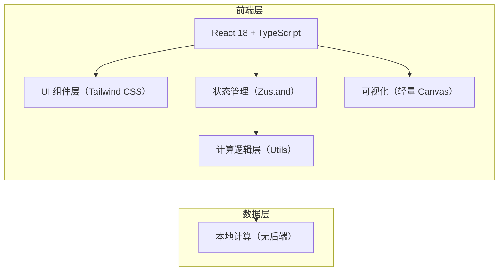

## 1. 架构设计



## 2. 技术说明

- **前端框架**：React@18 + TypeScript + Vite
- **样式方案**：Tailwind CSS 3
- **状态管理**：Zustand（轻量 store 管理计算参数与结果）
- **图标库**：Lucide React
- **图表方案**：原生 Canvas 绘制饼图和柱状图（避免引入重型图表库，保持轻量）
- **初始化工具**：vite-init（react-ts 模板）
- **后端**：无（纯前端计算，全部逻辑本地执行）
- **数据库**：无

## 3. 路由定义

| 路由 | 用途 |
|-----|------|
| / | 房贷计算器首页（单页应用，唯一页面） |

## 4. 核心数据结构（TypeScript 类型）

```typescript
// 贷款模式
type LoanMode = 'commercial' | 'provident' | 'combined';
// 还款方式
type RepaymentMethod = 'equal-principal-interest' | 'equal-principal';
// 还款计划视图
type ScheduleView = 'yearly' | 'monthly';

// 贷款参数
interface LoanParams {
  mode: LoanMode;
  // 商业贷款
  commercialAmount: number;      // 万元
  commercialRate: number;        // 年利率 %
  // 公积金贷款
  providentAmount: number;       // 万元
  providentRate: number;         // 年利率 %
  // 共同参数
  years: number;                 // 贷款年限
  method: RepaymentMethod;
}

// 单期还款明细
interface MonthlyPayment {
  month: number;                 // 第几期
  payment: number;               // 月供
  principal: number;             // 本月本金
  interest: number;              // 本月利息
  remainingPrincipal: number;    // 剩余本金
}

// 年度汇总
interface YearlySummary {
  year: number;
  totalPayment: number;
  totalPrincipal: number;
  totalInterest: number;
  remainingPrincipal: number;
  monthlyDetails: MonthlyPayment[];
}

// 计算结果
interface CalculationResult {
  monthlyPaymentFirst: number;   // 首月月供（等额本金时逐月递减）
  monthlyPaymentLast: number;    // 末月月供
  monthlyPaymentAvg: number;     // 平均月供
  totalPayment: number;          // 总还款额
  totalInterest: number;         // 总利息
  totalPrincipal: number;        // 总本金
  schedule: MonthlyPayment[];    // 逐月明细
  yearlySchedule: YearlySummary[]; // 逐年汇总
  commercialPart?: {             // 商业贷款部分（组合贷款）
    totalPayment: number;
    totalInterest: number;
  };
  providentPart?: {              // 公积金部分（组合贷款）
    totalPayment: number;
    totalInterest: number;
  };
}
```

## 5. 核心计算算法

### 5.1 等额本息（Equal Principal and Interest）
每月还款额固定，本金占比逐月增加，利息占比逐月减少。

```
月利率 r = 年利率 / 12
期数 n = 年限 × 12
月供 M = P × [ r × (1+r)^n ] / [ (1+r)^n - 1 ]
第 k 期利息 I_k = 剩余本金 × r
第 k 期本金 P_k = M - I_k
剩余本金 R_k = R_{k-1} - P_k
```

### 5.2 等额本金（Equal Principal）
每月偿还固定本金 + 剩余本金产生的利息，月供逐月递减。

```
每月固定本金 P_fixed = 总本金 / (年限 × 12)
第 k 期月供 M_k = P_fixed + R_{k-1} × r
第 k 期利息 I_k = R_{k-1} × r
剩余本金 R_k = R_{k-1} - P_fixed
```

### 5.3 组合贷款（Combined Loan）
商业贷款部分和公积金贷款部分分别独立计算，再将每期还款额相加汇总。

## 6. 项目结构

```
src/
├── components/
│   ├── Header.tsx              # 顶部标题区
│   ├── LoanForm.tsx            # 参数输入表单
│   ├── ResultCard.tsx          # 计算结果概览卡片
│   ├── ScheduleTable.tsx       # 还款计划表
│   ├── PieChart.tsx            # 本息占比饼图
│   └── BarChart.tsx            # 年度还款柱状图
├── hooks/
│   └── useLoanCalculator.ts    # 计算逻辑 Hook
├── store/
│   └── loanStore.ts            # Zustand 状态管理
├── utils/
│   ├── calculator.ts           # 核心计算函数
│   └── format.ts               # 数值格式化工具
├── types/
│   └── loan.ts                 # 类型定义
├── App.tsx                     # 主应用入口
├── main.tsx                    # React 挂载点
└── index.css                   # 全局样式（Tailwind 指令）
```
