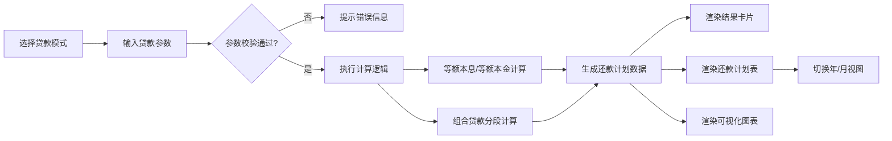

## 1. 产品概述

房贷计算器是一款面向购房用户的在线金融计算工具，帮助用户快速、准确地计算房贷月供、总利息及完整还款计划，支持商业贷款、公积金贷款及组合贷款三种模式。

- 核心目标：为购房者提供直观、专业的房贷计算服务，辅助购房决策
- 目标用户：有购房贷款需求的个人用户、房产中介、银行理财顾问
- 市场价值：解决房贷计算繁琐易错的痛点，提供透明、可视化的还款分析

## 2. 核心功能

### 2.1 功能模块

1. **贷款模式选择**：商业贷款 / 公积金贷款 / 组合贷款
2. **参数输入区**：贷款总额、年利率、贷款年限、还款方式切换
3. **结果概览区**：每月还款额、总还款额、总利息、还款方式对比
4. **还款计划表**：支持逐年/逐月两种视图，展示剩余本金、月供构成
5. **可视化图表**：本金与利息占比可视化

### 2.2 页面详情

| 页面名称 | 模块名称 | 功能描述 |
|---------|---------|---------|
| 首页（计算器） | 模式切换 | 单选切换商业/公积金/组合贷款模式 |
| 首页（计算器） | 输入表单 | 动态渲染对应贷款类型的参数输入项，包含数值校验 |
| 首页（计算器） | 结果卡片 | 高亮展示月供、总还款、总利息三大核心指标 |
| 首页（计算器） | 还款计划表 | 表格形式展示每期还款明细，支持年/月视图切换、分页 |
| 首页（计算器） | 数据可视化 | 饼图展示本息占比、柱状图展示年度还款趋势 |

## 3. 核心流程

用户选择贷款模式 → 输入贷款参数（金额/利率/年限/还款方式）→ 系统实时计算 → 展示核心结果概览 → 用户切换年/月视图查看还款明细 → 滚动浏览完整还款计划

## 4. 用户界面设计

### 4.1 设计风格

- **主色调**：深邃蓝 `#1e3a5f`（金融专业感）+ 青绿色 `#0d9488`（活力与增长）
- **辅助色**：琥珀金 `#f59e0b`（数据高亮）、中性灰系列
- **按钮风格**：圆角 12px，渐变填充，悬停微阴影上浮
- **字体**：标题使用 "Noto Serif SC" 衬线体营造专业感，正文使用 "Inter" 无衬线体保证可读性
- **布局风格**：卡片式分区布局，左侧输入区 + 右侧结果区（桌面端），上下堆叠（移动端）
- **图标风格**：Lucide 线性图标，配合彩色点缀

### 4.2 页面设计概述

| 页面名称 | 模块名称 | UI 元素 |
|---------|---------|---------|
| 首页 | 顶部 Hero | 渐变背景、装饰几何形状、大标题 + 副标题 |
| 首页 | 输入卡片 | 白色磨砂玻璃、柔和阴影、分组字段、图标前缀 |
| 首页 | 结果卡片 | 深蓝渐变背景、白色大字、左右本息对比 |
| 首页 | 还款计划表 | 斑马纹行、固定表头、悬停高亮、年度汇总行 |
| 首页 | 图表区 | 饼图 + 柱状图并排、动态 tooltip |

### 4.3 响应式

- 桌面端（≥1024px）：双栏布局，输入区 40% + 结果区 60%
- 平板端（768-1023px）：单栏堆叠，输入卡片与结果卡片并排
- 移动端（<768px）：单栏全宽，还款计划表启用横向滚动

### 4.4 动效细节

- 页面加载：卡片依次淡入上浮（stagger 100ms）
- 数值变化：数字滚动动画（countUp 效果）
- 还款计划表：行进入时渐入滑出
- 按钮/卡片：悬停 transform 微位移 + 阴影增强
